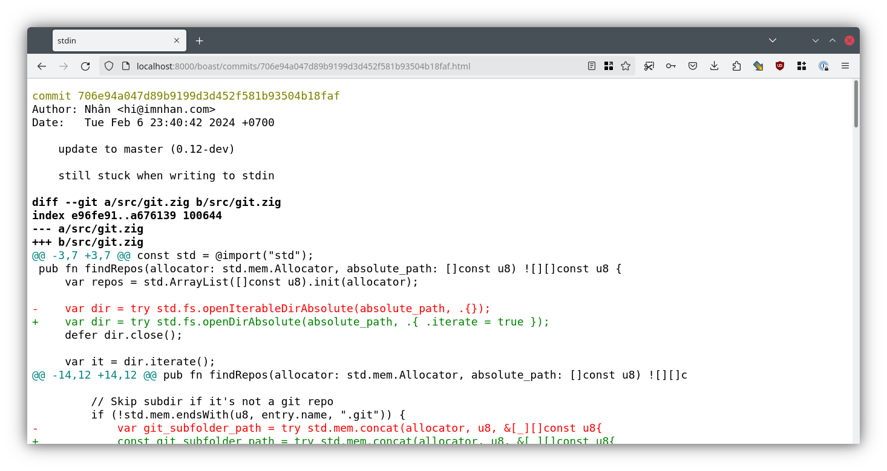

# WIP

The plan is to learn zig by gradually writing a [stagit][1] clone.
For now this is by no means ready for consumption.

# Deps

- Build: zig master
- Runtime:
    - `git`
    - [aha][2] to get colored diff as html.
    Maybe look into compiling aha into boast as well, see that it's just a
    single .c file.

[1]: https://codemadness.org/stagit.html
[2]: https://github.com/theZiz/aha
